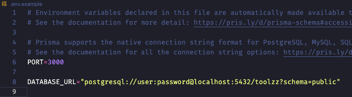

# Construção de um Microsserviços de Gerenciamento de Usuários em Node.js

---

###### Clone esse projeto

`git clone https://github.com/robertoApimenta/toolzz.git`

###### Acesse o diretório ./toolzz

###### Instale as dependências

`npm install`

###### Renomeie o arquivo .env.example para .env

###### Nesse mesmo arquivo preencha com suas credenciais postgres (usuário e senha):

###### Rode o servidor:

`npm start`

###### Acesse as rotas da aplicação, para isso vc pode usar o arquivo exportado do insomnia, ele está na raiz do projeto.

Pra rodar os testes unitário rode o comando:

`npm test`
